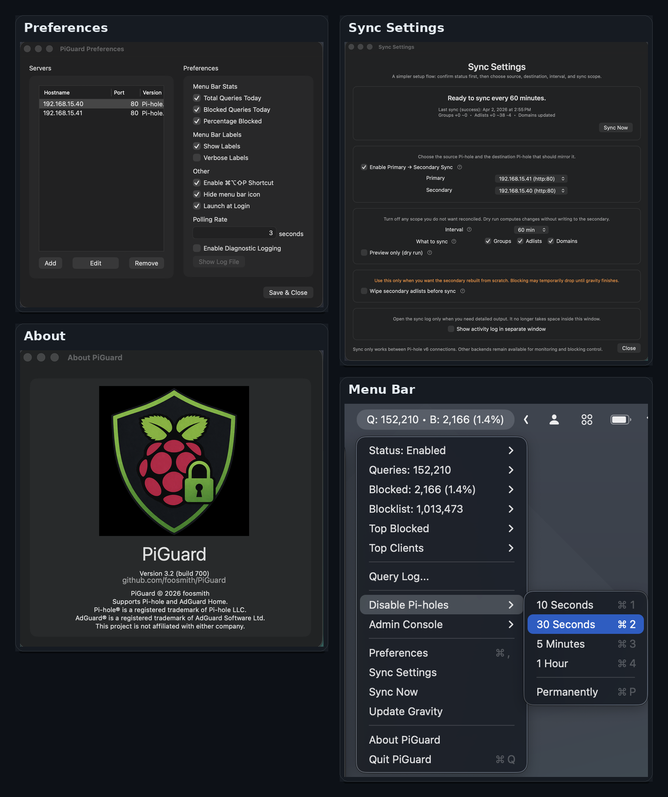

# PiGuard for macOS

PiGuard is a native macOS menu bar app for managing DNS filtering servers. It puts the controls you reach for most — blocking toggle, filter refresh, query log — one click away, and adds practical tools for home-lab setups running multiple servers.

This is a fork of the original [PiBar](https://github.com/amiantos/pibar) project, extended to support Pi-hole v6, AdGuard Home, and mixed-backend environments.

## Screenshots

## Pi-hole Features

- Connect to one or more Pi-hole servers (v5 and v6)
- Toggle blocking on or off from the menu bar
- Refresh Pi-hole gravity from the menu bar
- Pi-hole v6 connections authenticate with the app password flow and persist correctly across restarts

### Primary → Secondary Sync (Pi-hole v6)

PiGuard includes a built-in sync flow for keeping two Pi-hole v6 nodes in sync — useful for failover and mirrored DNS setups where manually clicking through two web UIs is not practical.

- Choose a primary and a secondary Pi-hole
- Sync on demand or on a schedule
- Sync groups, adlists, and domains
- Preview changes with dry run mode before writing anything
- Optionally wipe secondary adlists before rebuilding from primary
- Review sync status and activity log from within the app
- Visual in-progress indicator in the menu bar during sync

## AdGuard Home Features

- Connect to AdGuard Home alongside or instead of Pi-hole
- Toggle blocking on or off from the menu bar
- Refresh AdGuard Home filters from the menu bar
- Backend-aware connection settings with per-server configuration

AdGuard Home support is functional for the core workflow. The remaining work is validation, polish, and broader packaging cleanup as the app settles into its PiGuard identity.

## Query Log

PiGuard includes a searchable, sortable Query Log window.

- View recent DNS queries across all connected servers
- **Search** — type to filter rows instantly across domain, client, status, and server
- **Sort** — click the Domain, Client, or Status column header to sort; click again to reverse
- **Block or allow** from the query log without opening the web UI

## General

- Supports multiple server connections across Pi-hole and AdGuard Home
- Mixed-backend menu wording adapts to whichever servers are connected
- Launch at login, configurable from Preferences
- Global keyboard shortcut for quick menu bar access
- Configurable polling interval
- Opt-in diagnostic logging to a local log file

## Download & Install

### Current Public Build (build 706)

**[⬇ Download PiGuard-3.6.2-706-macOS.dmg](https://github.com/foosmith/PiGuard/releases/download/v3.6.2/PiGuard-3.6.2-706-macOS.dmg)**

Requires macOS 13 or later.

1. Download **PiGuard-3.6.2-706-macOS.dmg**
2. Open the DMG — a window will appear showing the app and an Applications shortcut
3. Drag the app into the **Applications** folder
4. Eject the DMG
5. Open PiGuard from **Launchpad** or **Applications** — it will appear in your menu bar

> **Gatekeeper on first launch:** This release is signed and notarized, so macOS should open it without prompting. If Finder warns anyway due to quarantine caching, eject the DMG, reopen it, and launch the app from **Applications** directly.

### What's New in v3.4

- **Security** — credentials migrated from UserDefaults to Keychain; orphaned Keychain entries cleaned up on connection removal
- **Stability** — thread-safety fixes for operation state and session token caching; force-unwrap crash paths eliminated
- **UI** — warning shown when Pi-hole v5 token is sent over plain HTTP

### What's New in v3.3

- **Stability** — credential caching, atomic settings writes, view error handling improvements
- **Security** — tokens redacted from diagnostic logs, force-unwraps removed

### What's New in v3.2

- **Query Log search** — filter rows instantly across domain, client, status, and server
- **Query Log sort** — click column headers to sort; click again to reverse
- **Pi-hole v6 sync** — fixed Windows tray actions and corrected sync payload key casing

All releases: [GitHub Releases](https://github.com/foosmith/PiGuard/releases)

## About This Fork

PiGuard is shaped around a few specific goals:

- First-class Pi-hole v6 support, including persistent auth and sync
- Practical tools for paired Pi-hole instances
- Mixed-network support for Pi-hole and AdGuard Home side by side
- Fewer setup annoyances
- Signed and notarized macOS builds

If you are running multiple DNS filtering servers and want a lightweight native macOS control point, that is what this project is built for.

## Feedback

- Issues and feature requests: [GitHub Issues](https://github.com/foosmith/PiGuard/issues)
- Release downloads and notes: [GitHub Releases](https://github.com/foosmith/PiGuard/releases)

## Credits

- Original PiBar created by [Brad Root](https://github.com/amiantos)
- PiGuard is maintained by [foosmith](https://github.com/foosmith)
- Pi-hole is a registered trademark of Pi-hole LLC
- AdGuard is a registered trademark of AdGuard Software Ltd
- This project is independent and is not affiliated with either company
